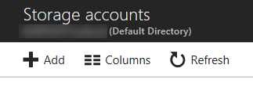
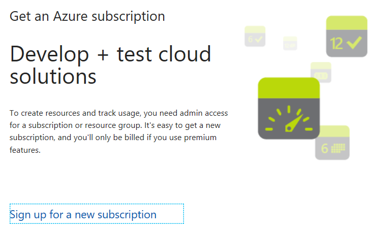
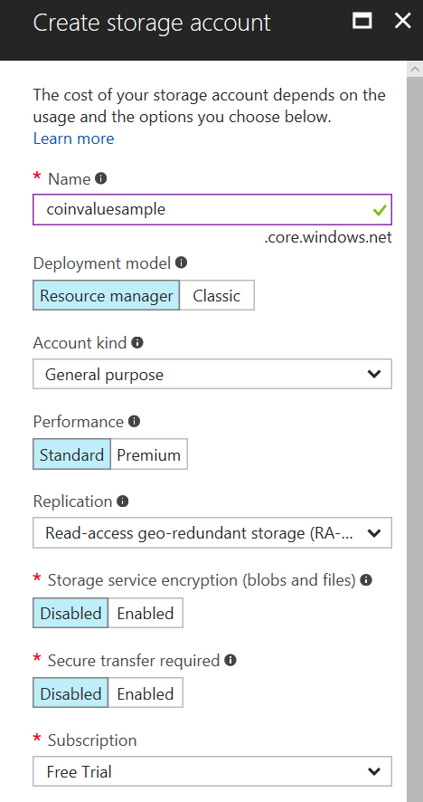
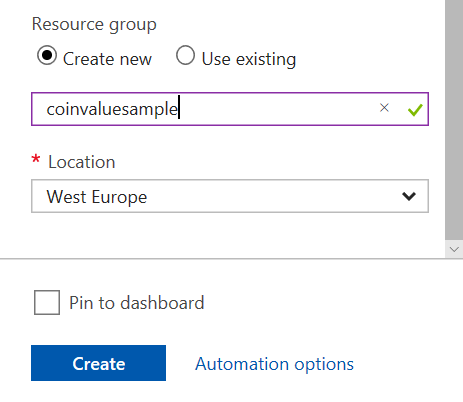

# Creating a trial account and a storage account in Azure

In order to try this sample, you will need an Azure subscription (which can be a free trial). This walkthrough will guide you step-by-step to create an Azure account and create a new resource group.

## 1. Getting a Microsoft account

The first step to get into Azure is to procure a Microsoft account (MSA). This is your single signon (SSO) entry to Microsoft services. There are multiple ways to get an MSA, and in fact you may already have one. If you want to use an existing MSA (such as an outlook.com email address), you can skip to step 2 "Creating the Azure account".

You can use outlook.com email addresses as MSA. To create a new email address, a good idea is to open a private web browser window. This will avoid issues with existing accounts in case you were already logged in. In Microsoft Edge, you can open a New InPrivate Window from the "…" menu on the top right. Then select the corresponding menu.

Then follow the steps:

1. In the InPrivate browser window, navigate to the Outlook page at <http://outlook.com>.

2. Select Create Account

3. Fill the information. You will need to select a unique email address. Make sure to write down the user name and password that you entered.

4. Click on Create.

## 2. Creating the Azure account

Now that you have a Microsoft account, we will use this to create the Azure account. To do this, follow the steps:

1. Head to the Azure Portal at <https://portal.azure.com>.

2. Enter the Microsoft account user name and password. Note: If you are already logged into your MSA in the same browser window, you won't have to enter your password again.

Now, you have the possibility to take a tour to get to know Azure better, or you can just get started.

## 3. Creating the trial subscription

At this point, you can already explore the portal, but if you want to create a resource group to publish a sample or your own application, you will need to create a subscription. Thankfully you can try things out with free credit. This will allow you to experiment and see how everything is working before you decide to pay for the resources that you use.

Depending on the type of resource that you want to create, the starting point will be slightly different but the process of creating your subscription is the same. In this article, I will describe how to create a storage account but you can also create a trial subscription when you create other resources.

### 3.1 Creating the storage account

On the left hand side of the portal, you will see a choice of services. We will now create a new resource group to manage the resources that the application requires. To do this, follow the steps:

1. Locate the "Storage account" menu and select it.

>**Note:** If you see only the icons in the left menu, you can expand it by using the "hamburger" menu on top of the icon list ()

2. Select the Add button on the top left corner.

3. If you already have a subscription, you can jump to step 3.3. Otherwise, you should see the image below. Click on the link titled "Sign up for a new subscription".

### 3.2 Creating the subscription

1. Clicking on the link opens a new window. Make sure that you are logged in with the email account that you want to use. The email account is listed in the top right corner.

2. Fill up the "About you" form and click on Next.

3. Fill up the "Identity verification by phone form" and click on "Send Message". This will send a text to your mobile phone.

4. Enter the code that you just received in the corresponding field and click on "Verify code". If you have not received a code, you can click the "I did not receive a code" button to get a new one.

5. Fill up the "Identity verification by card" form. Note that **you will NOT get billed**. This is purely to make sure that your identity is correct, and to avoid fraudulous accounts.

6. After your card has been successfully verified, agree to the subscription agreement, offer details, and privacy statement and click on Sign up.

After a short wait, your subscription is ready, and you can take a tour, check some tutorials or return to the account creation which is waiting for you in the previous browser window. Once you are done, navigate back [to the Azure Portal](https://portal.azure.com).

### 3.3 Finishing to create the storage account

If you have followed the steps under 3.2 above, and you created a new subscription, you will be back in the Azure Portal. Again, click on the "Storage Account" menu, and then on the Add button. Most of the values should be prepopulated.

1. In the "Storage Account" blade, enter the new account name. For example here I selected coinvalue. Please note that the storage account name should be between 3 and 24 characters, and only lowercase letters and/or numbers.

2. Select the subscription you want to use. If you just created a free subscription, it should be available in the combo box.

3. Enter a Resource group name. This will be where all the resources needed by your application will be grouped. This makes it easier to find resources.

4. Select the location for the resource group. You can select any of the multiple Azure datacenters around the globe.

5. Click on the "Create" button at the bottom.

